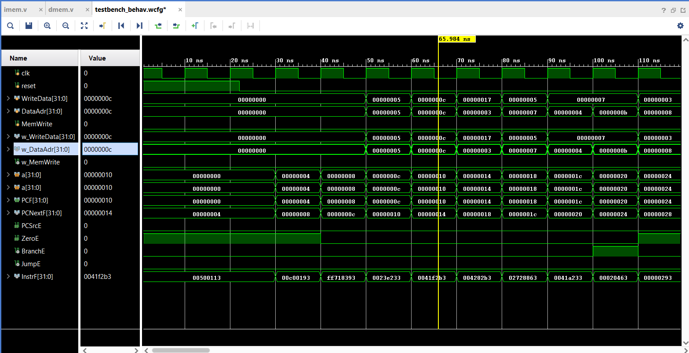

# RISC-V Pipelined CPU (Verilog)

Overview: A 5-stage pipelined RISC-V processor written in Verilog. It supports the RV32I instruction set and includes hazard detection, forwarding logic, and basic branching while pipelining the instructions.

---

## 🧠 Block Diagram

---

## 🚀 Features

1. **5-Stage Pipeline:** Instruction Fetch, Decode, Execute, Memory, and Writeback stages allowing multiple instructions to run simultaneously.
2. **Hazard Detection & Forwarding:** Ensures correct execution of instructions by resolving data hazards dynamically.
3. **ALU:** Handles arithmetic and logical operations such as ADD, SUB, AND, OR, etc.
4. **Datapath & Control Unit:** The datapath processes instructions while the control unit issues control signals to coordinate all modules.
5. **Memory System:**  
   - **Instruction Memory (IMEM):** Stores instructions.  
   - **Data Memory (DMEM):** Stores and retrieves data used during execution.
6. **Testbench:** Simulates and verifies the processor functionality under Vivado.

---

## 📁 Key Files

| File           | Description                                |
|----------------|--------------------------------------------|
| `top.v`        | Top-level module                           |
| `datapath.v`   | Main datapath containing all pipeline logic |
| `controller.v` | Generates control signals                  |
| `alu.v`        | Arithmetic Logic Unit                      |
| `hazard.v`     | Detects hazards and forwards data          |
| `regfile.v`    | 32-register file                           |
| `testbench.v`  | Simulation testbench                       |

---

## 💻 Tools Used

- **Simulator:** Xilinx Vivado  
- **HDL:** Verilog

---

## 🛠️ How to Simulate

1. Compile all `.v` files.
2. Include these memory initialization files:
   - `rvpfinal.hex`
   - `rvtest.hex`
   - `regfile.hex`
3. Run `testbench.v` as the top simulation module.

---

## 📈 Simulation Output

---

## 📜 License

You can apply an open-source license such as MIT or Apache 2.0 if you'd like.

---

Made  by [Harshal Rudraksha-B.Tech in Electrical Engineering,IIT Indore](https://github.com/beyblade34125)
